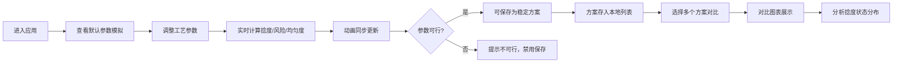

## 1. 产品概述

纺车捻度模拟器是一个交互式的前端模拟应用，用于可视化展示传统纺车在不同工艺参数下生成纱线的过程。用户可以调整纺车转速、牵伸速度和纤维长度等参数，实时观察纱线形成的动画效果，并获取捻度、断线风险和均匀度等关键指标。

- **核心目标**：通过直观的可视化和实时计算，帮助用户理解纺纱工艺参数与纱线质量之间的关系
- **目标用户**：纺织专业学生、工艺工程师、纺织爱好者
- **产品价值**：将复杂的纺纱工艺转化为可交互、可实验的数字化体验

## 2. 核心功能

### 2.1 用户角色

| 角色 | 注册方式 | 核心权限 |
|------|----------|----------|
| 普通用户 | 无需注册 | 调整参数、查看动画、保存实验方案、对比结果 |

### 2.2 功能模块

1. **主模拟面板**：纱线形成动画展示、实时指标显示、捻度状态指示
2. **参数控制面板**：转速调节、牵伸速度调节、纤维长度调节
3. **实验管理**：保存当前参数方案、方案列表管理、删除方案
4. **对比分析**：多方案对比图表、低捻/适中/过捻状态区分

### 2.3 页面详情

| 页面名称 | 模块名称 | 功能描述 |
|-----------|-------------|---------------------|
| 主页面 | 参数控制面板 | 三个滑块分别控制转速、牵伸速度、纤维长度，实时显示数值，带单位标注 |
| 主页面 | 动画展示区 | SVG/Canvas 动画模拟纱线加捻过程，纺车轮转动，纱线捻回可视化 |
| 主页面 | 实时指标卡 | 显示当前捻度值、断线风险百分比、均匀度评分 |
| 主页面 | 状态指示器 | 用颜色区分低捻（蓝）、适中（绿）、过捻（橙）三种状态 |
| 主页面 | 实验方案保存区 | 命名输入框、保存按钮、方案列表（可删除） |
| 主页面 | 对比图表区 | 柱状图/雷达图对比多个方案的各项指标，颜色区分捻度状态 |

## 3. 核心流程

用户进入应用 → 查看默认参数下的纱线模拟动画 → 调整转速/牵伸速度/纤维长度滑块 → 实时观察动画和指标变化 → 判断是否为可行方案 → 命名并保存当前参数 → 添加多个方案后 → 在对比区查看多方案对比图表 → 分析低捻/适中/过捻状态分布

## 4. 用户界面设计

### 4.1 设计风格

- **设计方向**：工业科技风 + 传统工艺质感
- **主色调**：深青色（#0F766E）作为主色，代表精密与工艺
- **辅助色**：琥珀色（#D97706）表示警告/过捻，天蓝色（#0284C7）表示低捻，翠绿色（#059669）表示适中/正常
- **中性色**：石板灰系列，深色背景搭配浅色文字，营造专业仪表盘感
- **字体**：标题使用现代无衬线字体，正文使用清晰易读的系统字体
- **按钮风格**：圆角矩形，微浮雕效果，悬停有光泽变化
- **布局风格**：卡片式仪表盘布局，左侧控制面板，中间动画区，右侧指标和方案区
- **图标风格**：线性图标，与整体工业风一致

### 4.2 页面设计概览

| 页面名称 | 模块名称 | UI 元素 |
|-----------|-------------|-------------|
| 主页面 | 顶部标题栏 | 应用名称、副标题、装饰性纺车图标 |
| 主页面 | 参数控制卡片 | 三个滑块组件，带数值显示和单位，滑块轨道有渐变效果 |
| 主页面 | 动画展示卡片 | 深色背景，SVG 纺车动画，纱线动态效果 |
| 主页面 | 指标卡片组 | 三张数据卡片，分别显示捻度、断线风险、均匀度，带图标和趋势指示 |
| 主页面 | 状态指示条 | 水平渐变色条，指针指示当前捻度状态位置 |
| 主页面 | 方案保存区 | 输入框 + 保存按钮，方案列表带删除操作 |
| 主页面 | 对比图表区 | 柱状图，不同颜色柱子代表不同捻度状态 |

### 4.3 响应式

- 采用桌面端优先设计，主布局为三栏式
- 平板端自动调整为两栏布局
- 移动端堆叠为单栏，动画区域缩放适配
- 所有交互元素支持触控操作

### 4.4 动画效果

- 纺车轮旋转动画，速度与转速参数关联
- 纱线捻回螺旋动画，捻度越高螺旋越密
- 参数变化时数值有平滑过渡效果
- 卡片悬停有微妙上浮和阴影加深
- 保存/删除操作有流畅的反馈动画
