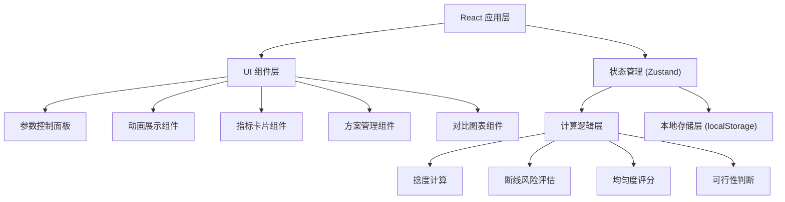

## 1. 架构设计



## 2. 技术选型

- **前端框架**：React 18 + TypeScript
- **构建工具**：Vite 5
- **样式方案**：Tailwind CSS 3
- **状态管理**：Zustand
- **图表库**：Recharts
- **图标库**：Lucide React
- **动画方案**：CSS 动画 + requestAnimationFrame
- **数据持久化**：localStorage
- **包管理器**：npm

## 3. 项目结构

```
src/
├── components/          # 组件目录
│   ├── ControlPanel/    # 参数控制面板
│   ├── YarnAnimation/   # 纱线动画组件
│   ├── MetricCards/     # 指标卡片
│   ├── StatusIndicator/ # 状态指示器
│   ├── ExperimentList/  # 实验方案列表
│   └── CompareChart/    # 对比图表
├── hooks/               # 自定义 Hooks
│   ├── useYarnCalc.ts   # 纱线计算 Hook
│   └── useAnimation.ts  # 动画控制 Hook
├── store/               # 状态管理
│   └── useStore.ts      # Zustand Store
├── utils/               # 工具函数
│   ├── calculations.ts  # 计算逻辑
│   └── constants.ts     # 常量配置
├── types/               # 类型定义
│   └── index.ts
├── App.tsx              # 主应用组件
├── main.tsx             # 入口文件
└── index.css            # 全局样式
```

## 4. 数据模型

### 4.1 类型定义

```typescript
interface YarnParams {
  spindleSpeed: number;      // 纺车转速 (rpm)
  draftSpeed: number;        // 牵伸速度 (m/min)
  fiberLength: number;       // 纤维长度 (mm)
}

interface YarnMetrics {
  twist: number;             // 捻度 (捻/m)
  twistLevel: 'low' | 'optimal' | 'high';  // 捻度等级
  breakRisk: number;         // 断线风险 (0-100%)
  uniformity: number;        // 均匀度评分 (0-100)
  isFeasible: boolean;       // 是否为可行方案
}

interface Experiment {
  id: string;
  name: string;
  params: YarnParams;
  metrics: YarnMetrics;
  createdAt: number;
}
```

### 4.2 计算规则

1. **捻度计算**：捻度 ≈ 转速 / 牵伸速度 × 转换系数
2. **断线风险**：随捻度过高而增加，随纤维长度减小而增加
3. **均匀度**：适中捻度时最高，过低或过高都会下降
4. **可行性判断**：断线风险超过阈值或参数超范围时判定为不可行

## 5. 状态管理

使用 Zustand 管理全局状态：
- 当前参数状态
- 当前计算结果
- 已保存的实验方案列表
- 选中用于对比的方案 ID 列表

## 6. 关键技术点

1. **SVG 动画**：使用 SVG path + CSS transform 实现纺车和纱线动画
2. **实时计算**：参数变化时立即重新计算所有指标，useMemo 优化性能
3. **响应式布局**：Tailwind CSS Grid + Flexbox 实现自适应
4. **本地持久化**：实验方案保存到 localStorage，刷新不丢失
5. **图表可视化**：Recharts 柱状图展示多方案对比
